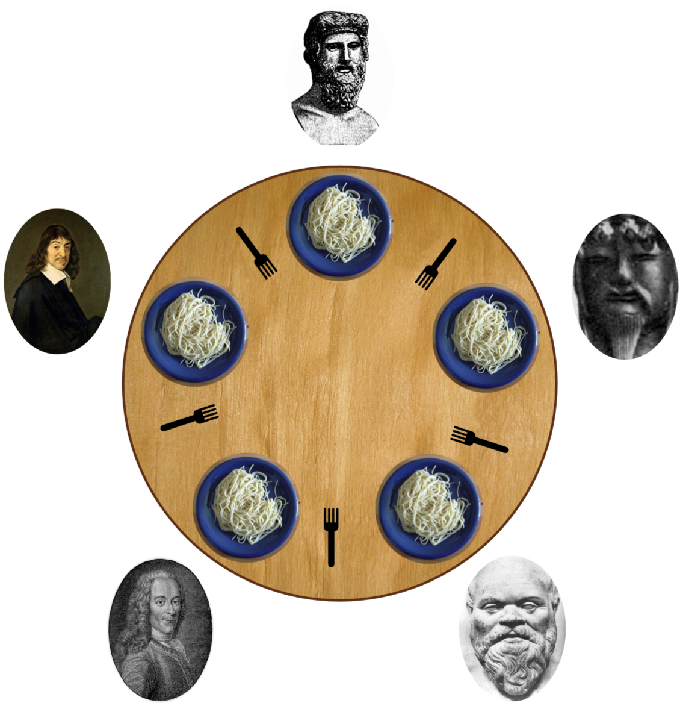

# SO2_Projekt - Problem jedzących filozofów
###### Projekt na przedmiot Systemy Operacyjne 2
###### Autor: Piotr Staworko

# Instrukcja uruchomienia
W celu uruchomienia programu należy pobrać plik wykonywalny (DiningPhilosophers.exe) z zakładki releases na repozytorium na githubie. 
Następnie należy go uruchomić. 
Po uruchomieniu, w konsoli powinny wyświetlić się kolejno pytania o:
- liczbę filozofów
- czas 'jedzenia spaghetti' (w ms) przez filozofów
- minimalny czas myślenia (w ms) przez filozofów
- maksymalny czas myślenia (w ms) przez filozofów

Czas myślenia posiada zakres, gdyż jest on ustalany losowo, w celu dywersyfikacji problemu (aby nie zawsze wszyscy filozofowie chcieli jeść w tym samym momencie).

Zalecane ustawienia tych zmiennych:
- liczba filozofów: 5
- czas 'jedzenia spaghetti': 2000
- minimalny czas myślenia: 1000
- maksymalny czas myślenia: 4000

# Opis problemu
Problem jedzących filozofów jest klasycznym zadaniem dotyczącym synchronizacji procesów.
Problem wygląda następująco:

Przy okrągłym stole siedzi n filozofów. Każdy z nich może wykonywać dwie czynności - jeść spaghetti lub myśleć. 
Przed każdym z nich stoi miska ze spaghetti, a pomiędzy każdymi dwoma filozofami znajduje się widelec (każdy filozof ma w ten sposób do dyspozycji dwa widelce - po lewej oraz prawej stronie miski).
W przypadku gdy filozof chce zjeść, musi on to robić dwoma widelcami; jednym przecież byłoby ciężko. Filozofowie dodatkowo są nadzwyczaj mało rozmowni, więc w żaden sposób się ze sobą nie komunikują.
Zależnie od podejścia do problemu, może wystąpić ryzyko zakleszczenia (deadlock), czyli przypadku w którym nasi filozofowie nie będą w stanie jeść, ponieważ widelce będą zajęte przez innych filozofów. 
Mogłoby się tak stać, gdy np.: Każdy z filozofów na raz podniesie widelec po swojej lewej stronie.
# Rozwiązanie problemu - opis implementacji
W programie występują dwie kluczowe klasy - `Philosopher` - reprezentujący filozofa, każdy obiekt jest wątkiem oraz `Fork` - reprezentujący widelec, każdy obiekt jest mutexem.

W mojej implementacji problemu, każdy z filozofów zasiada przy stole i zaczyna od myślenia, przez losową ilość czasu z zadanego zakresu.
Filozof, gdy zrobi się głodny, od razu próbuje podnieść oba widelce, a następnie zjeść spaghetti. Jeśli nie uda mu się podnieść któregoś z widelców, to zrezygnowany odkłada wszystkie i próbuje ponownie gdy znów się zrobi głodny .

W celu sprawdzania poprawności działania, dodałem funkcje wypisujące na ekranie następujące informacje:
- Kiedy filozof zaczyna myśleć, oraz od jakiego czasu nie jadł,
- Kiedy filozof zaczyna jeść, oraz czy udało mu się podnieść oba widelce,
- Timestampy każdego z tych zdarzeń, używając do tego godziny, minut oraz sekund z zegara systemowego.

